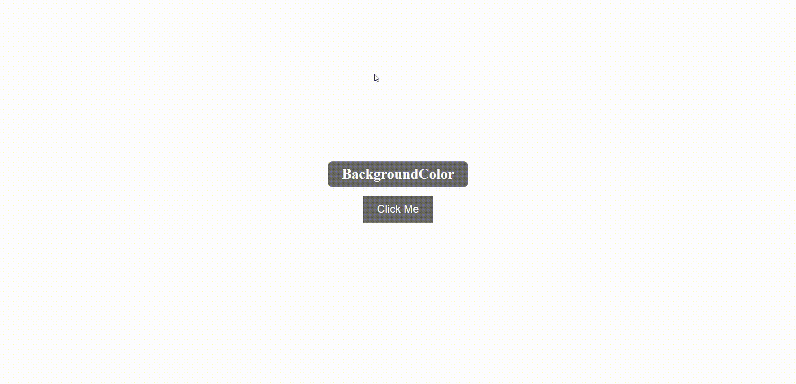

# Background Color Change Project

This project is a small but fun web page that allows users to change the background color of the page with the simple click of a button. Designed with an intuitive user interface and a sleek visual design, it's a simple way to explore the impact of different background colors on the overall look and feel of a web page.

The project is built using standard web technologies: HTML, CSS, and JavaScript. HTML is used to create the structure of the page, including a title, a color display area, and a button. CSS styles are then applied to position these elements on the page, to define their appearance, and to create a responsive layout that looks good on all screen sizes. JavaScript provides the functionality to change the background color. It does this by listening for a click event on the button, then choosing a random color from a predefined array and applying this color as the new background color.

## Gif

. BackgroundColor

## Project Structure

The project consists of several files:

- `README.md`: This file provides an overview of the project, including instructions on how to use it, the project structure, and contact information.
- `index.html`: The HTML file that forms the backbone of the webpage. It defines a structure consisting of a title, a color display, and a button.
- `index.css`: This CSS file contains the styles that are used to design the page. This includes layouts, colors, fonts, and more.
- `app.js`: The JavaScript file that adds interactivity to the webpage. It listens for a button click, selects a random color from an array, and applies this color as the background of the body.
- `images/`: If there were any images used in the project, they would be stored in this directory. Currently, this project does not utilize any images.

## Usage

To use this webpage, open the `index.html` file in any modern web browser. Once the page loads, you will see a title, a color display, and a "Click Me" button. When you click the button, the JavaScript code will select a random color from a predefined array and update the background color of the page. The name of the current background color will also be displayed in the title.

## Contributions

While this project was initially created as a practice project and is not currently accepting contributions, you are welcome to use the code as a reference or as a starting point for your own projects. Feel free to explore and expand upon this code in your own work.

## License

This project is open source and is licensed under the terms of the MIT license. This means you can use, copy, modify, merge, publish, distribute, sublicense, and/or sell copies of the software.

## Contact

For any questions, comments, feedback, or concerns, please don't hesitate to reach out to me at [umity@uia.no](mailto:umity@uia.no). I appreciate any and all feedback and am always happy to help answer any questions you might have.
