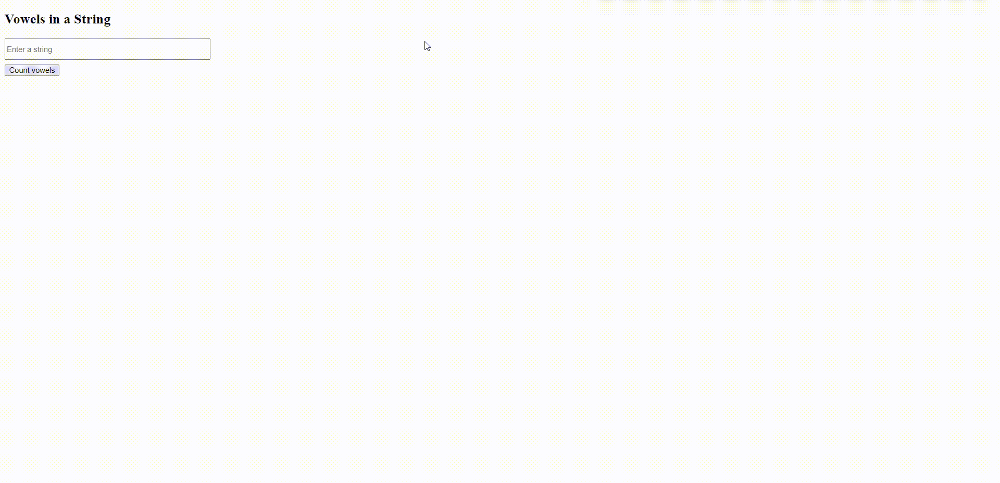

# Vowels in a String Project

This project is a simple web-based application that counts the number of vowels in a string. The application takes a user-inputted string and calculates the number of vowels (i.e., a, e, i, o, u) present. The application is designed to be user-friendly with an intuitive interface, offering real-time updates to users as they interact with it.

## Project Structure

This project consists of several important files:

- `README.md`: This markdown file you are currently reading. It contains important information about the project, how to run it, and the project's structure.
- `index.html`: The HTML file responsible for the structure of the web page. It contains an input field for entering a string, a button that triggers the function to count the vowels, and a paragraph to display the result.
- `index.css`: This file contains all the styles that make our project look good. It includes styles for the input field and the button.
- `index.js`: The JavaScript file that contains the function to count the vowels in the string. This function is triggered when the button in the `index.html` is clicked.

## Gif

. Vowels

## Usage

To use this application, just open the `index.html` file in your preferred web browser. You will see an input field where you can enter a string, and a button to trigger the function to count the vowels. After you enter your string and click the button, you will see the result displayed below the button. The result shows the total number of vowels in your inputted string.

## Contributions

Although this project was initially developed for learning and demonstration purposes, any suggestions for improvements or enhancements are welcomed. Please reach out via the contact information provided below if you'd like to discuss further.

## License

This project is open source and is licensed under the MIT License. This means you are free to use, modify, and distribute the project, as long as the original work is credited.

## Contact

For any questions, feedback, or discussion related to this project, please feel free to reach out at [umity@uia.no](mailto:umity@uia.no). I welcome any opportunity to engage with those interested in this project or its related fields.
